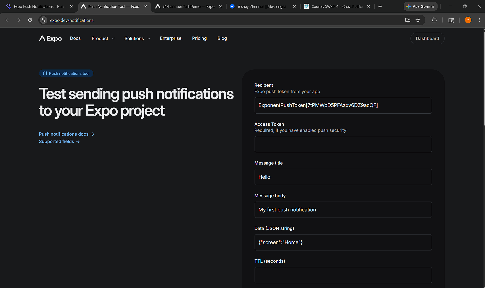
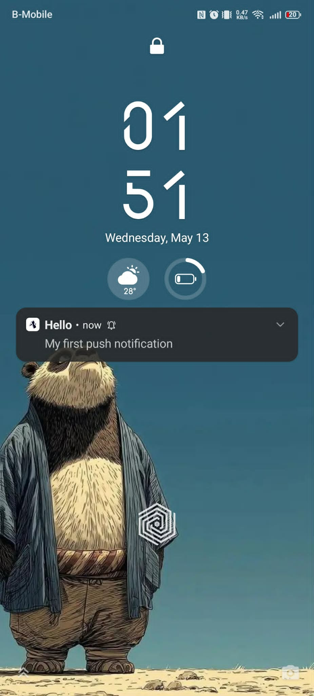

# Practical 4: Push Notification Demo

## 1. Aim

To design and implement a React Native application using Expo that demonstrates push notification setup, token registration, and local notification handling on a physical device.

## 2. Objective

By the end of this practical, the learner will be able to:

- Configure Expo notifications in a React Native project.
- Request permission and register a device for push notifications.
- Retrieve and display the Expo push token.
- Trigger and test a local notification within the app.
- Handle incoming notifications and user taps using notification listeners.

## 3. Learning Outcomes

After completing this practical, the learner should be able to:

- Build an Expo app that supports push notifications.
- Understand the role of physical devices in push notification testing.
- Use expo-notifications to schedule and receive notifications.
- Display notification data such as the push token and last received message.
- Write clean and modular React Native code for notification-based features.

## 4. Requirements

### Software Requirements

- Node.js
- npm
- Expo Go app
- Visual Studio Code
- Expo project with expo-notifications, expo-device, and expo-constants installed

### Hardware Requirements

- A computer with internet access
- A physical Android or iOS device for testing notifications
- Optional emulator for general app testing

## 5. Program / Code

Repo link: https://github.com/Zhennue/SS2026_SWE201_02240372/tree/main/practicals/practical_4

## 6. Output

The app displays the Expo push token, the last received notification body, and a button to fire a local notification after 2 seconds.

## 7. Observation

During execution, I observed that the app successfully registered for notifications on a physical device, displayed the push token, and triggered local notifications as expected.

## 8. Problem Encountered

The main challenge was setting up notifications correctly on a real device and making sure the project ID, permissions, and notification listeners were configured properly. Testing on an emulator was not enough for push notification behavior.

## 9. Conclusion

This practical helped me understand how push notifications work in an Expo React Native app. By registering the device, retrieving the push token, and testing local notifications, I gained useful hands-on experience with mobile notification features.
